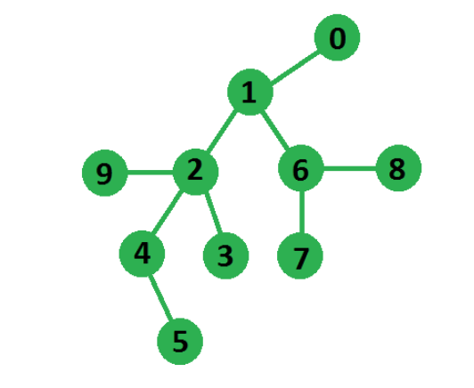

# Longest path in an undirected tree
Given an undirected tree, we need to find the longest path of this tree where a path is defined as a sequence of nodes. 

Example: 
```
Input : Below shown Tree using adjacency list 
        representation:
Output : 5
In below tree longest path is of length 5
from node 5 to node 7
```


In this post, an efficient solution is discussed. We can find the longest path using two BFSs. The idea is based on the following fact: If we start BFS from any node x and find a node with the longest distance from x, it must be an endpoint of the longest path. It can be proved using contradiction. So our algorithm reduces to simple two BFSs. First BFS to find an endpoint of the longest path and second BFS from this endpoint to find the actual longest path. 

For the proof of why does this algorithm works, there is a nice explanation here Proof of correctness: Algorithm for the diameter of a tree in graph theory 

As we can see in the above diagram, if we start our BFS from node-0, the node at the farthest distance from it will be node-5, now if we start our BFS from node-5 the node at the farthest distance will be node-7, finally, the path from node-5 to node-7 will constitute our longest path.